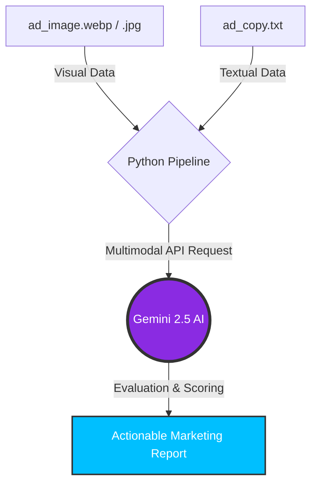

# Multimodal Meta Ads Analyzer

An AI-powered Python automation tool designed for Digital Marketing Agencies and Media Buyers. This script leverages Google Gemini's multimodal capabilities to analyze Facebook and Instagram Ad creatives (Image + Copy) simultaneously, acting as an automated Senior Marketing Director.

Instead of A/B testing blindly and wasting ad spend, this tool evaluates the synergy between visual assets and text, providing a conversion score, identifying weaknesses, and giving actionable advice to increase the CTR (Click-Through Rate).

---

## 🏗️ System Architecture




---

## 🛠️ Key Features
- **True Multimodal AI:** Processes and understands both images (`Pillow`) and text simultaneously, just like a human user scrolling through a social media feed.
- **Contextual Awareness:** Can detect discrepancies between what the image shows and what the text sells (e.g., selling running shoes with a picture of skate shoes).
- **Strict Prompt Engineering:** Forces the AI to output a structured, zero-fluff report: Score (1-10), Strengths, Weaknesses, and Actionable Advice.
- **Cost & Time Efficient:** Evaluates ad creatives in seconds before spending budget on Meta Ads Manager.

---

## 📂 Project Structure
- `multimodal_analyzer.py` - The core application script.
- `ad_image.webp` - Sample input image (the visual creative).
- `ad_copy.txt` - Sample input text (the ad caption/copy).
- `.env.example` - Template for secure API key management.

---

## 🇮🇹 VERSIONE ITALIANA (Presentazione Progetto)

### Analizzatore Multimodale per Pubblicità Meta (Facebook/Instagram)
Questo software è un "Direttore Marketing Automatizzato". Le agenzie spendono migliaia di euro in test per capire quali immagini e testi funzionino meglio. Questo script in Python fa un'analisi preventiva unendo "la vista e la lettura".

### Il Vantaggio per l'Azienda
Invece di lanciare campagne alla cieca, l'agenzia fornisce al programma l'immagine della pubblicità e il testo del post. L'Intelligenza Artificiale le analizza contemporaneamente e restituisce un report spietato: dà un voto da 1 a 10 alla probabilità di conversione, evidenzia cosa non va (es. "L'immagine è bella ma il testo è troppo lungo e non c'è una Call to Action") e suggerisce come sistemarla prima di pagare per la sponsorizzata.

### Competenze Tecniche Dimostrate:
- **Gestione Dati Multimodali:** Capacità di inviare formati diversi (immagini e testi) in una singola chiamata API.
- **Integrazione Librerie Esterne:** Utilizzo della libreria `Pillow` (PIL) per l'ingestione e la gestione di file grafici tramite codice.
- **Business Logic:** Utilizzo dell'Intelligenza Artificiale non per "chattare", ma per risolvere problemi aziendali specifici (ottimizzazione del ROI pubblicitario).
- **Sicurezza:** Architettura sicura tramite variabili d'ambiente (`.env`).

---

## 🔧 Installation & Setup

1. Clone this repository to your local machine.
2. Activate your Virtual Environment:
   ```bash
   .\venv\Scripts\activate
   ```
3. Install the required Python libraries (including `pillow` for image processing):
   ```bash
   pip install google-genai python-dotenv pillow
   ```
4. Create a `.env` file in the root directory and securely add your Gemini API Key:
   ```text
   GEMINI_API_KEY=your_actual_api_key_here
   ```
5. Place your ad image (`ad_image.webp`) and your text copy (`ad_copy.txt`) in the folder.
6. Run the analyzer:
   ```bash
   python multimodal_analyzer.py
   ```
